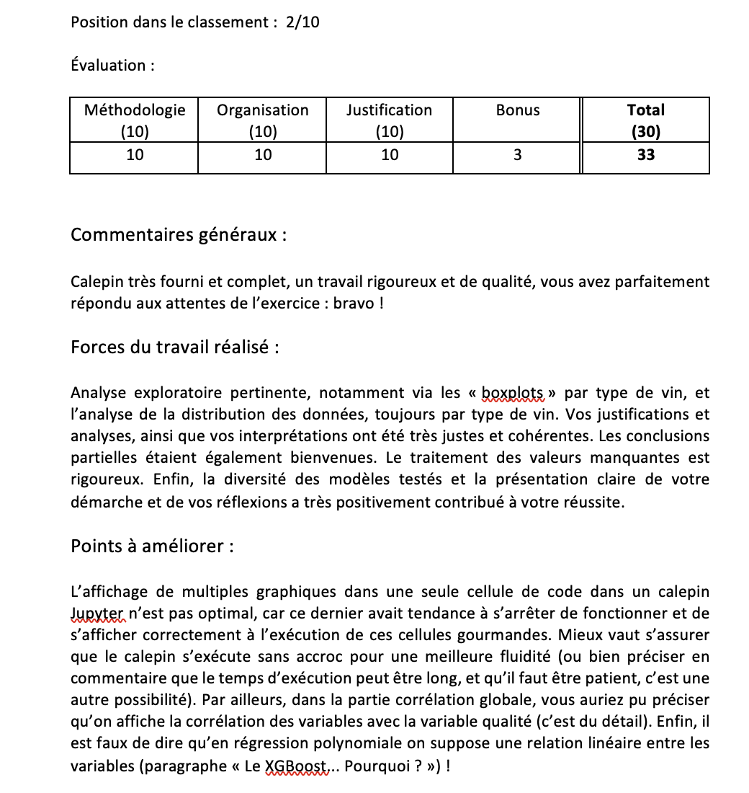

# MTH3302 - Probabilistic-and-Statistical-Methods-for-AI

# Project Overview
This project was completed as part of the MTH3302 - Probabilistic and Statistical Methods for AI course at Polytechnique Montréal. The goal was to predict wine quality scores (0-10 scale) based on chemical properties using machine learning techniques.

# Project Description
- Objective:

* Build predictive models to estimate wine quality (red/white) using chemical characteristics

-Data:

* train.csv: Training set with chemical features and expert quality ratings

* test.csv: Test set with chemical features (quality ratings to be predicted)

Evaluation Metric: Root Mean Squared Error (RMSE)

-Approach:

* Explored linear, non-linear and tree-based models

* Conducted thorough exploratory data analysis with visualizations

* Implemented rigorous missing value treatment

* Tested diverse modeling approaches with clear methodology

# Results:
* Achieved 2nd place out of 10 teams in the class ranking

* Received perfect scores (10/10) in Methodology, Organization and Justification

* Earned 33/30 points (including bonus points)

# Key Strengths (from professor's evaluation):
* Comprehensive and rigorous notebook

* Pertinent exploratory analysis (boxplots by wine type, data distribution analysis)

* Accurate justifications and coherent interpretations

* Excellent handling of missing values

* Clear presentation of methodology and thought process

* Useful partial conclusions
